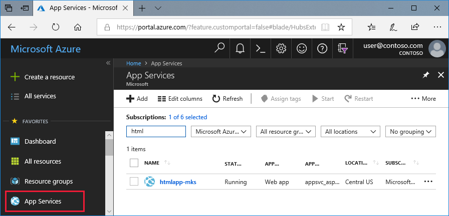
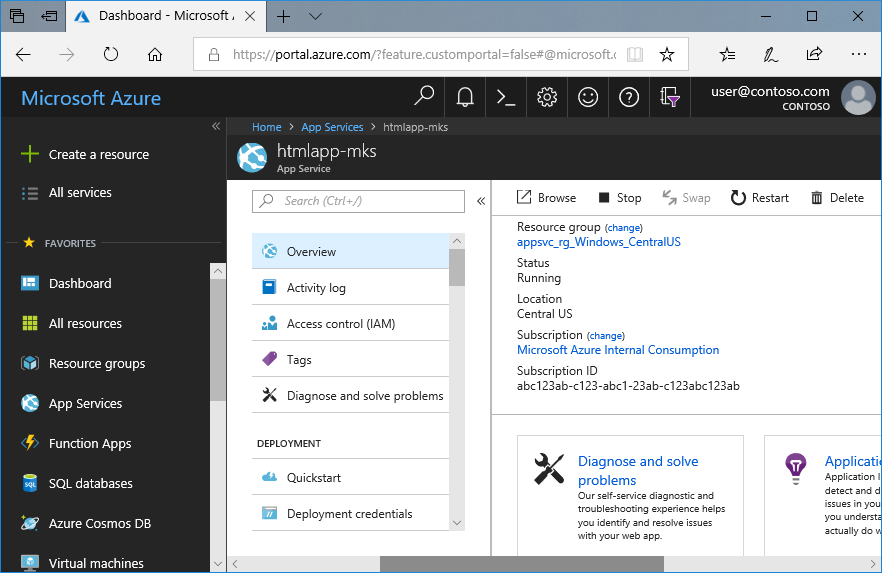

# HTML Hello World

This sample demonstrates a tiny Hello World HTML app for [App Service](https://docs.microsoft.com/azure/app-service).

# Contributing

This project has adopted the [Microsoft Open Source Code of Conduct](https://opensource.microsoft.com/codeofconduct/). For more information see the [Code of Conduct FAQ](https://opensource.microsoft.com/codeofconduct/faq/) or contact [opencode@microsoft.com](mailto:opencode@microsoft.com) with any additional questions or comments.

## Online Quickstart Documentation

|  |  |
|--|--|
| Link | https://docs.microsoft.com/en-us/azure/app-service/app-service-web-get-started-html |
| Published | 08/28/2018 |
| Length | 3 minutes to read |
| Contributors | msangapu,  Cephas Lin,  Caro Caserio |
|  |  |
 
# Create a static HTML web app in Azure

[Azure Web Apps](https://docs.microsoft.com/en-us/azure/app-service/app-service-web-overview) provides a highly scalable, self-patching web hosting service. This quickstart shows how to deploy a basic HTML+CSS site to Azure Web Apps. You'll complete this quickstart in [Cloud Shell](https://docs.microsoft.com/azure/cloud-shell/overview), but you can also run these commands locally with [Azure CLI](https://docs.microsoft.com/cli/azure/install-azure-cli).

If you don't have an Azure subscription, create a [free account](https://azure.microsoft.com/free/?ref=microsoft.com&utm_source=microsoft.com&utm_medium=docs&utm_campaign=visualstudio) before you begin.

## Open Azure Cloud Shell
Azure Cloud Shell is a free, interactive shell that you can use to run the steps in this article. Common Azure tools are preinstalled and configured in Cloud Shell for you to use with your account. Just select the **Copy** button to copy the code, paste it in Cloud Shell, and then press Enter to run it. There are a few ways to open Cloud Shell:

|  |  |
|--|--|
|Select **Try It** in the upper-right corner of a code block.   |  |
| Open Cloud Shell in your browser.  |  |
| Select the **Cloud Shell** button on the menu in the upper-right corner of the [Azure portal](https://portal.azure.com/).  |  |
|  |  |

## Install web app extension for Cloud Shell
To complete this quickstart, you need to add the [az web app extension](https://docs.microsoft.com/cli/azure/extension?view=azure-cli-latest#az-extension-add). If the extension is already installed, you should update it to the latest version. To update the web app extension, type `az extension update -n webapp`.

To install the webapp extension, run the following command:

    az extension add --name webapp

When the extension has been installed, the Cloud Shell shows information to the following example:

    The installed extension 'webapp' is in preview.

## Download the sample
In the Cloud Shell, create a quickstart directory and then change to it.

    mkdir quickstart
    cd quickstart

Next, run the following command to clone the sample app repository to your quickstart directory.

    git clone https://github.com/Azure-Samples/html-docs-hello-world.git

## Create a web app
Change to the directory that contains the sample code and run the `az webapp up` command.

In the following example, replace <app_name> with a unique app name.

    cd html-docs-hello-world
    az webapp up --location westeurope --name <app_name>

The `az webapp up` command does the following actions:

- Create a default resource group.
- Create a default app service plan.
- Create an app with the specified name.
- [Zip deploy](https://docs.microsoft.com/azure/app-service/app-service-deploy-zip) files from the current working directory to the web app.

This command may take a few minutes to run. While running, it displays information similar to the following example:

    {
      "app_url": "https://<app_name>.azurewebsites.net",
      "location": "westeurope",
      "name": "<app_name>",
      "os": "Windows",
      "resourcegroup": "appsvc_rg_Windows_westeurope",
      "serverfarm": "appsvc_asp_Windows_westeurope",
      "sku": "FREE",
      "src_path": "/home/<username>/quickstart/html-docs-hello-world ",
      < JSON data removed for brevity. >
    }

Make a note of the `resourceGroup` value. You need it for the [clean up resources](https://docs.microsoft.com/en-us/azure/app-service/app-service-web-get-started-html#clean-up-resources) section.

## Browse to the app
In a browser, go to the Azure web app URL: `http://<app_name>.azurewebsites.net`.

The page is running as an Azure App Service web app.

**Congratulations!** You've deployed your first HTML app to App Service.

## Update and redeploy the app
In the Cloud Shell, type `nano index.html` to open the nano text editor. In the `<h1>` heading tag, change "Azure App Service - Sample Static HTML Site" to "Azure App Service", as shown below.

Save your changes and exit nano. Use the command `^O` to save and `^X` to exit.

You'll now redeploy the app with the same `az webapp up` command.

    az webapp up --location westeurope --name <app_name>

Once deployment has completed, switch back to the browser window that opened in the **Browse to the app** step, and refresh the page.

## Manage your new Azure web app
Go to the [Azure portal](https://portal.azure.com/) to manage the web app you created.

From the left menu, click **App Services**, and then click the name of your Azure web app.

You see your web app's Overview page. Here, you can perform basic management tasks like browse, stop, start, restart, and delete.

The left menu provides different pages for configuring your app.

## Clean up resources
In the preceding steps, you created Azure resources in a resource group. If you don't expect to need these resources in the future, delete the resource group by running the following command in the Cloud Shell. Remember that the resource group name was automatically generated for you in the [create a web app](https://docs.microsoft.com/en-us/azure/app-service/app-service-web-get-started-html#create-a-web-app) step.

    az group delete --name appsvc_rg_Windows_westeurope

This command may take a minute to run.
